<p align="center">
 
 <h2 align="center">Code::Stats Readme</h2>
 <p align="center">Get dynamically generated Code::Stats stats on your readmes!</p>
</p>

# Features

- [Profile Card](#profile-card)
- [History Card](#history-card)
- [Top Languages Card](#top-languages-card)
- [Common Options](#common-options)

# Profile Card



## Options

| Option Name | Description                                                 |
| ----------- | ----------------------------------------------------------- |
| hide        | Hide specific line, eg: `&hide=xp` or `&hide=xp,recent_xp`  |
| show_icons  | Shows icons before each lines eg: `&show_icons`             |
| hide_rank   | Hide the rank circle eg: `&hide_rank`                       |
| line_height | Change the line Height of each lines, eg: `&line_height=45` |
| icon_color  | Change the icons color, eg: `&icon_color=123456&show_icons` |
| text_color  | Change the text colors, eg: `&text_color=123456`            |

# History Card



## Options

| Option Name    | Description                                                                                                 |
| -------------- | ----------------------------------------------------------------------------------------------------------- |
| layout         | Change the layout to the horizontal one<br />ex: `&layout=horizontal`                                       |
| height         | Change the height of the card _Only on horizontal layout_<br />ex: `&height=400`<br />Default: `300`        |
| width          | Change the width of the card _Only on vertical layout_<br />ex: `&width=TypeScript`<br />Default: `500`     |
| title          | Change the title of the card<br />ex: `&title=History`                                                      |
| days_count     | Change the number of days shown<br />ex: `&days_count=7` <br />Default: `14`                                |
| reverse_order  | Reverse the order of the days<br />ex: `&reverse_order`                                                     |
| hide           | Hide specifics languages and put them in Others<br />ex: `&hide=TypeScript`                                 |
| language_count | Change the number of languages shown before going to Others<br />ex: `&language_count=3`<br />defaults: `8` |
| text_color     | Change the text colors<br />ex: `&text_color=654321`                                                        |

# Top Languages Card



## Options

| Option Name    | Description                                                                                                 |
| -------------- | ----------------------------------------------------------------------------------------------------------- |
| hide           | Hide Specific language<br />ex: `&hide=TypeScript` or `&hide=TypeScript,TypeScript%20(JSX)`                 |
| language_count | Change the number of languages shown before going to Others<br />ex: `&language_count=3`<br />defaults: `8` |
| card_width     | Hide the rank circle<br />ex: `&card_width=600`<br />defaults: `300`                                        |
| layout         | Make the layout more compact<br />ex: `&layout=compact`                                                     |
| text_color     | Cange the text colors<br />ex: `&text_color=654321`                                                        |


# Common Options

| Options Name  | Description                                                                                                                |
| ------------- | -------------------------------------------------------------------------------------------------------------------------- |
| title_color   | Change the title color<br />ex: `&title_color=654321`                                                                      |
| bg_color      | Change the background color<br />ex: `&bg_color=654321`                                                                    |
| hide_border   | Hide the border<br />ex: `&hide_border`                                                                                    |
| hide_title    | Hide the title<br />ex: `&hide_border`                                                                                     |
| theme         | See [#themes](Themes)                                                                                                      |
| cache_seconds | set the cache header manually _(min: 1800, max: 86400)_<br />ex: `&cache_seconds=86400`<br />Default: `1800` or 30 minutes |
| title         | CHange the cards title. eg: `&title=My Code::Stats`                                                                        |

# Themes

With inbuilt themes you can customize the look of the card without doing any [manual customization](#customization).

Use `?theme=THEME_NAME` parameter like so :-

dark, radical, merko, gruvbox, tokyonight, onedark, cobalt, synthwave, highcontrast, dracula

You can checkout the [theme config file](./themes/index.js)!

# Development

Both ways will create a webserver that listens on port 3000.

## Docker

```shell
docker build . --tag codestats-readme
docker run codestats-readme
```

## NPM

```shell
npm install
npm run build
npm run start
```
